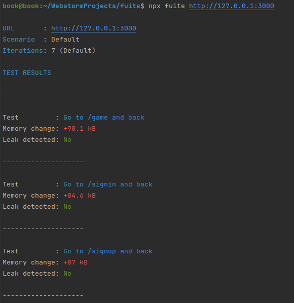

# Утечки памяти

## Что использовалось для проверки

1. Chrome DevTools
2. Firefox Developer Tools (memory, [profiler](https://github.com/firefox-devtools/profiler))
3. Библиотека мониторинга памяти [fuite](https://github.com/nolanlawson/fuite)

## Как проверялось

Осуществлялись переходы по страницам, взаимодействие с игровым канвасом

  
Chrome DevTools

    

  
Firefox Developer Tools

    

  
Fuite

    

Во всех инструментах после прекращения взаимодействия со страницей величина используемой памяти вернулась к исходному значению

## Результаты

При проверке утечек памяти не обнаружено
